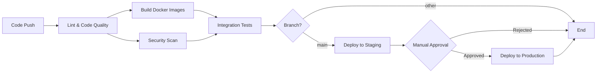

# CI/CD Pipeline Documentation

This document describes the Continuous Integration and Continuous Deployment (CI/CD) pipeline for the Distributed Notification System.

## Overview

The CI/CD pipeline is implemented using **GitHub Actions** and consists of three main workflows:

1. **CI/CD Pipeline** (`ci-cd.yml`) - Main pipeline for building, testing, and deploying
2. **Automated Tests** (`test.yml`) - Comprehensive test suite
3. **Docker Publishing** (`docker-publish.yml`) - Build and publish Docker images

## Workflows

### 1. CI/CD Pipeline (`ci-cd.yml`)

**Triggers:**
- Push to `main` or `develop` branches
- Pull requests to `main` or `develop` branches

**Jobs:**

#### Job 1: Lint and Code Quality
- Checks out code
- Sets up Node.js 18
- Installs dependencies for all 5 services
- Runs linting (ESLint if configured)

#### Job 2: Build Docker Images
- Runs in parallel for all 5 services (matrix strategy)
- Uses Docker Buildx for efficient builds
- Caches layers using GitHub Actions cache
- Saves images as artifacts for later jobs
- **Services built:**
  - api_gateway_service
  - user_service
  - template_service
  - email_service
  - push_service

#### Job 3: Integration Tests
- Starts PostgreSQL, Redis, and RabbitMQ as services
- Downloads and loads Docker images from previous job
- Starts all services with docker-compose
- Waits for services to be healthy
- **Tests performed:**
  - Health checks for all services
  - End-to-end notification flow
  - User creation and notification sending
  - Rate limiting verification
- Captures logs on failure

#### Job 4: Security Scan
- Runs Trivy vulnerability scanner
- Scans filesystem for security issues
- Uploads results to GitHub Security tab
- Runs in parallel with build job

#### Job 5: Deploy to Staging
- **Trigger:** Push to `main` branch only
- **Environment:** staging
- Deploys to staging environment
- Placeholder for actual deployment steps:
  - Push images to container registry
  - Update Kubernetes/ECS configs
  - Run database migrations
  - Perform smoke tests

#### Job 6: Deploy to Production
- **Trigger:** After successful staging deployment
- **Environment:** production (requires manual approval)
- Deploys to production environment
- Placeholder for production deployment:
  - Blue-green or canary deployment
  - Database migrations with rollback plan
  - Health checks and monitoring

---

### 2. Automated Tests (`test.yml`)

**Triggers:**
- Push to `main`, `develop`, or `feature/**` branches
- Pull requests to `main` or `develop`
- Scheduled daily at 2 AM UTC

**Jobs:**

#### Job 1: Unit Tests
- Runs in parallel for all 5 services (matrix strategy)
- Installs dependencies
- Runs unit tests (placeholder for actual tests)
- Uploads coverage reports as artifacts

#### Job 2: API Tests
- Starts PostgreSQL, Redis, and RabbitMQ
- Starts all services with docker-compose
- **Comprehensive API testing:**
  
  **User Service CRUD:**
  - ✓ Create user
  - ✓ Get user by ID
  - ✓ Update user
  - ✓ List users
  - ✓ Delete user
  
  **Template Service CRUD:**
  - ✓ Create template
  - ✓ Get template by ID
  - ✓ Get template by name
  - ✓ Update template (creates new version)
  - ✓ Get version history
  - ✓ List templates
  - ✓ Delete template
  
  **Notification Flow:**
  - ✓ End-to-end notification sending
  - ✓ Validates 202 Accepted response
  
  **Idempotency:**
  - ✓ Sends same request twice with same key
  - ✓ Validates second request returns cached response
  
  **Rate Limiting:**
  - ✓ Makes multiple rapid requests
  - ✓ Validates rate limiting is active
  - ✓ Counts successful vs rate-limited requests

#### Job 3: Performance Test
- **Trigger:** Push to `main` branch only
- Runs basic performance test
- Measures requests per second
- Placeholder for advanced tools:
  - Apache Bench (ab)
  - wrk
  - k6
  - Artillery

---

### 3. Docker Publishing (`docker-publish.yml`)

**Triggers:**
- Push to `main` branch
- Git tags matching `v*.*.*` (e.g., v1.0.0)
- Release published

**Jobs:**

#### Job 1: Build and Push
- Runs in parallel for all 5 services
- Logs in to GitHub Container Registry (ghcr.io)
- Extracts metadata for image tags
- **Image tags generated:**
  - Branch name (e.g., `main`)
  - Semantic version (e.g., `1.0.0`, `1.0`, `1`)
  - Git SHA (e.g., `main-abc1234`)
  - `latest` (for default branch)
- Builds multi-platform images (amd64, arm64)
- Pushes to GitHub Container Registry
- Generates artifact attestation

#### Job 2: Update Deployment
- Updates deployment manifests with new image tags
- Placeholder for GitOps workflow

---

## Pipeline Flow Diagram



## Test Coverage

### Current Tests
- ✅ Health checks for all services
- ✅ User Service CRUD operations
- ✅ Template Service CRUD operations
- ✅ End-to-end notification flow
- ✅ Idempotency verification
- ✅ Rate limiting verification
- ✅ Basic performance testing

### Future Tests (To Implement)
- ⏳ Unit tests for individual functions
- ⏳ Circuit breaker behavior tests
- ⏳ Cache hit/miss ratio tests
- ⏳ Retry mechanism tests
- ⏳ Dead letter queue tests
- ⏳ Load testing (1000+ notifications/min)
- ⏳ Stress testing
- ⏳ Email delivery verification
- ⏳ Push notification delivery verification

---

## Environment Variables

### Required Secrets
Configure these in GitHub repository settings:

- `GITHUB_TOKEN` - Automatically provided by GitHub Actions
- `DOCKER_USERNAME` - Docker Hub username (if using Docker Hub)
- `DOCKER_PASSWORD` - Docker Hub password (if using Docker Hub)

### Optional Secrets (for production deployment)
- `AWS_ACCESS_KEY_ID` - AWS credentials
- `AWS_SECRET_ACCESS_KEY` - AWS credentials
- `KUBECONFIG` - Kubernetes configuration
- `SMTP_PASSWORD` - SMTP server password
- `FCM_SERVER_KEY` - Firebase Cloud Messaging key

---

## Deployment Environments

### Staging Environment
- **URL:** https://staging.example.com
- **Purpose:** Pre-production testing
- **Deployment:** Automatic on push to `main`
- **Database:** Separate staging database
- **External Services:** Test SMTP and FCM accounts

### Production Environment
- **URL:** https://api.example.com
- **Purpose:** Live production system
- **Deployment:** Manual approval required
- **Database:** Production database with backups
- **External Services:** Production SMTP and FCM accounts
- **Monitoring:** Full monitoring and alerting

---

## Running Tests Locally

### Run All Tests
```bash
# Start services
docker-compose up -d

# Wait for services to be ready
sleep 30

# Run health checks
curl http://localhost:3000/health
curl http://localhost:3001/health
curl http://localhost:3002/health

# Run API tests (see test.yml for examples)
```

### Run Specific Service Tests
```bash
cd user_service
npm test
```

### Run Integration Tests
```bash
# Use the test scripts from .github/workflows/test.yml
```

---

## Monitoring and Observability

### GitHub Actions Dashboard
- View workflow runs: `https://github.com/<owner>/<repo>/actions`
- Check test results
- View deployment status
- Download artifacts (coverage reports, logs)

### Deployment Status
- Staging: Check staging environment health endpoint
- Production: Check production environment health endpoint

### Logs
- GitHub Actions logs available for 90 days
- Service logs available via `docker-compose logs`

---

## Rollback Procedure

### Staging Rollback
```bash
# Revert to previous commit
git revert HEAD
git push origin main
```

### Production Rollback
1. Go to GitHub Actions
2. Find the last successful production deployment
3. Re-run the deployment job
4. Or manually deploy previous image tag:
   ```bash
   docker pull ghcr.io/<owner>/api_gateway_service:<previous-sha>
   # Update deployment manifests
   ```

---

## Best Practices

### Branch Strategy
- `main` - Production-ready code
- `develop` - Integration branch
- `feature/*` - Feature branches
- `hotfix/*` - Urgent fixes

### Commit Messages
- Use conventional commits: `feat:`, `fix:`, `docs:`, `test:`, etc.
- Example: `feat: add rate limiting to API gateway`

### Pull Requests
- All changes must go through PR
- Require at least 1 approval
- All tests must pass
- Security scan must pass

### Versioning
- Use semantic versioning (MAJOR.MINOR.PATCH)
- Tag releases: `git tag v1.0.0`
- Automated changelog generation

---

## Troubleshooting

### Build Failures
- Check Docker build logs
- Verify Dockerfile syntax
- Check for missing dependencies

### Test Failures
- Review test logs in GitHub Actions
- Run tests locally to reproduce
- Check service health endpoints

### Deployment Failures
- Check deployment logs
- Verify environment variables
- Check database migrations
- Verify external service connectivity

### Security Scan Failures
- Review Trivy scan results
- Update vulnerable dependencies
- Apply security patches

---

## Future Enhancements

1. **Code Coverage Enforcement** - Require minimum coverage percentage
2. **Automated Changelog** - Generate changelog from commits
3. **Slack/Discord Notifications** - Notify team of deployments
4. **Performance Benchmarking** - Track performance over time
5. **Database Migration Testing** - Test migrations in CI
6. **E2E Tests with Cypress/Playwright** - Browser-based testing
7. **Load Testing with k6** - Comprehensive performance testing
8. **Canary Deployments** - Gradual rollout to production
9. **Blue-Green Deployments** - Zero-downtime deployments
10. **Automated Rollback** - Rollback on health check failure

---

## Resources

- [GitHub Actions Documentation](https://docs.github.com/en/actions)
- [Docker Build Push Action](https://github.com/docker/build-push-action)
- [Trivy Security Scanner](https://github.com/aquasecurity/trivy)
- [Semantic Versioning](https://semver.org/)

