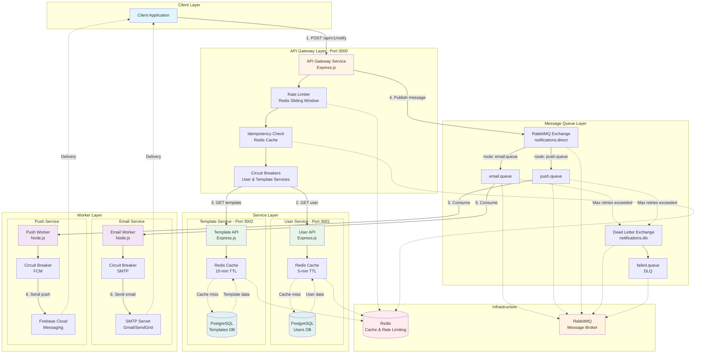
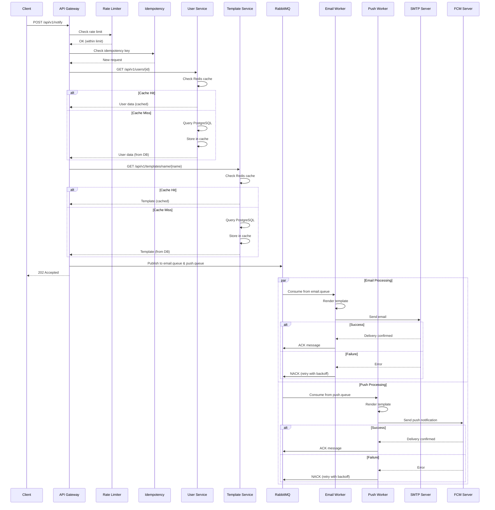
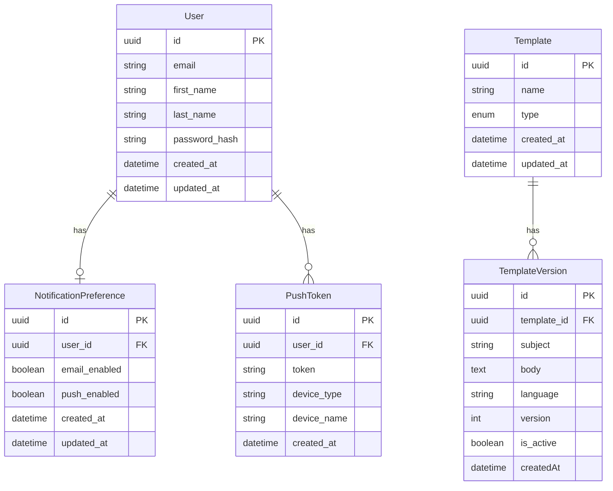
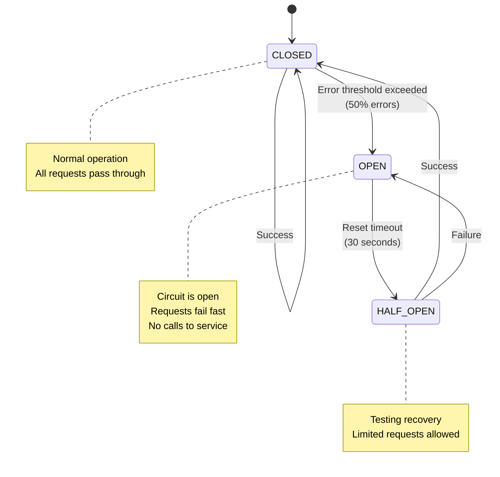
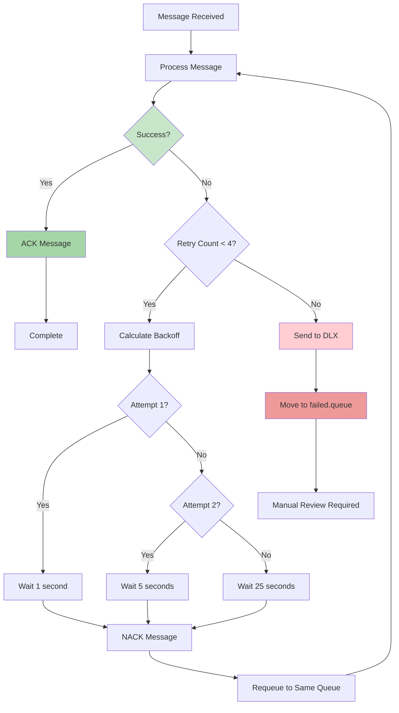

# System Design - Distributed Notification System

## Architecture Overview

This document provides a comprehensive overview of the distributed notification system architecture, including all services, data flows, and technical features.

## High-Level Architecture Diagram



## Request Flow Sequence



## Data Models



## Circuit Breaker State Machine



## Retry Mechanism Flow



## Technology Stack

### Services
- **Runtime**: Node.js 18
- **Framework**: Express.js
- **Language**: JavaScript (ES6+)

### Databases
- **PostgreSQL**: User and Template data
- **Redis**: Caching, rate limiting, idempotency
- **Prisma ORM**: Database access layer

### Message Queue
- **RabbitMQ**: Message broker
- **amqplib**: Node.js client library

### External Services
- **SMTP**: Email delivery (Gmail/SendGrid)
- **FCM**: Push notification delivery

### Infrastructure
- **Docker**: Containerization
- **Docker Compose**: Multi-container orchestration

### Monitoring & Resilience
- **Opossum**: Circuit breaker implementation
- **Winston/Console**: Logging

### Documentation
- **Swagger/OpenAPI 3.0**: API documentation
- **swagger-jsdoc**: JSDoc to OpenAPI conversion
- **swagger-ui-express**: Interactive API docs

## Key Features

### 1. Rate Limiting
- **Algorithm**: Sliding window using Redis sorted sets
- **Limit**: 100 requests per minute per IP
- **Headers**: `X-RateLimit-Limit`, `X-RateLimit-Remaining`, `X-RateLimit-Reset`
- **Response**: 429 Too Many Requests when exceeded

### 2. Idempotency
- **Storage**: Redis with 24-hour TTL
- **Header**: `Idempotency-Key`
- **Behavior**: Returns cached response for duplicate requests

### 3. Circuit Breaker
- **Library**: Opossum
- **Timeout**: 5-10 seconds
- **Error Threshold**: 50%
- **Reset Timeout**: 30 seconds
- **Protected Services**: User Service, Template Service, SMTP, FCM

### 4. Caching Strategy
- **User Data**: 5-minute TTL
- **Template Data**: 10-minute TTL
- **Invalidation**: On update/delete operations
- **Fail-Open**: Continues on cache failure

### 5. Retry Strategy
- **Max Attempts**: 4
- **Backoff**: Exponential (1s, 5s, 25s)
- **Dead Letter Queue**: After max retries
- **Manual Review**: Failed messages in DLQ

### 6. Asynchronous Processing
- **Pattern**: Fire-and-forget
- **Response**: 202 Accepted immediately
- **Processing**: Workers consume from queues
- **Decoupling**: API Gateway doesn't wait for delivery

## Performance Characteristics

### API Gateway
- **Response Time**: < 100ms (target)
- **Throughput**: 100+ requests/minute per IP
- **Availability**: High (circuit breakers prevent cascading failures)

### Workers
- **Email Processing**: ~1-2 seconds per email
- **Push Processing**: ~500ms per notification
- **Concurrency**: Multiple workers can run in parallel

### Caching
- **Cache Hit Rate**: 80%+ (expected)
- **Cache Response Time**: < 10ms
- **Database Response Time**: 50-100ms

## Scalability Considerations

### Horizontal Scaling
- **API Gateway**: Can run multiple instances behind load balancer
- **Workers**: Can run multiple instances (RabbitMQ distributes load)
- **Services**: User and Template services can be scaled independently

### Vertical Scaling
- **Database**: PostgreSQL can be upgraded for more connections
- **Redis**: Can be upgraded for more memory
- **RabbitMQ**: Can handle millions of messages

### Bottlenecks
- **Database**: Most likely bottleneck (mitigated by caching)
- **External Services**: SMTP and FCM rate limits
- **RabbitMQ**: Queue depth monitoring needed

## Security Considerations

### Authentication & Authorization
- **Current**: Basic password hashing (bcrypt)
- **Future**: JWT tokens, OAuth2

### Data Protection
- **Passwords**: Hashed with bcrypt
- **Tokens**: Stored securely in database
- **API Keys**: Environment variables

### Network Security
- **Docker Network**: Services isolated in Docker network
- **External Access**: Only API Gateway exposed

## Monitoring & Observability

### Health Checks
- All services expose `/health` endpoints
- Circuit breaker stats available
- Docker health checks configured

### Logging
- Correlation IDs for request tracking
- Structured logging with timestamps
- Error logging with stack traces

### Metrics (Future)
- Request rate and response times
- Queue depth and processing rate
- Cache hit/miss ratios
- Circuit breaker state changes

## Deployment

### Development
```bash
docker-compose up -d
```

### Production Considerations
- Use managed PostgreSQL (AWS RDS, Google Cloud SQL)
- Use managed Redis (AWS ElastiCache, Redis Cloud)
- Use managed RabbitMQ (CloudAMQP, AWS MQ)
- Implement proper secrets management
- Add SSL/TLS for all connections
- Implement proper monitoring and alerting

## Future Enhancements

1. **Notification Status Tracking**: Track delivery status in database
2. **Webhook Support**: Notify clients of delivery status
3. **Template Preview**: Preview templates before sending
4. **A/B Testing**: Test different template versions
5. **Analytics**: Track open rates, click rates
6. **Multi-tenancy**: Support multiple organizations
7. **Scheduled Notifications**: Send notifications at specific times
8. **Batch Processing**: Send bulk notifications efficiently

